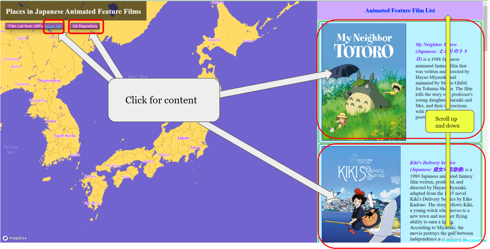
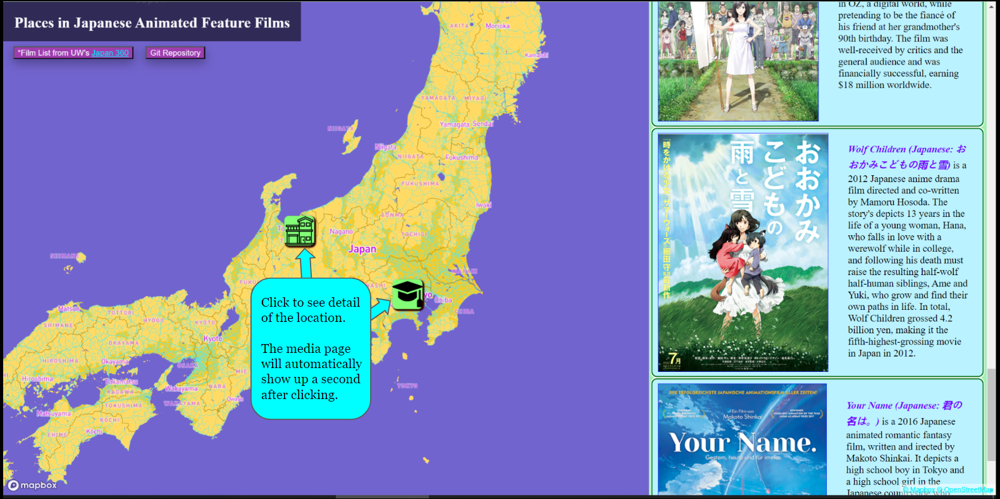

# Animated-Feature-Films-Map

> [Access](https://elaborate-crumble-7f08ba.netlify.app){:target="_blank"} the Map

This is my final project for Japan 360: Japanese Anime Feature Films. This project aims to visualize the significant places in the films we watched throughout the class and to provide brief descriptions, backstories, and fun facts about those films.

## Usage Guide
After entering the map by clicking on the blue "Access" in Access the Map above, there will be a warning about spoilers and sounds. After closing that, the main page will be shown like below. The areas highlighted are sections that can be clicked to access content. The side panel on the right can be scrolled up and down to show more movies.

If a movie poster is clicked, markers will pop up on the map if there are real-world location references in the movie. Once a marker is clicked, the map will fly to the location of the marker and show a popup containing a brief description. After about a 1.5-second delay, the media overlay containing clips and images about the movie and the places will appear. The media overlay can be closed if you want to keep reading the description or look at the map. It can also be re-opened if you click on the marker again. If there are no real locations, the media overlay will appear directly afterward.

Inside the media overlay, you can use the "<" and ">" or the dots below the media to navigate through the different pages. Videos will contain sound and will play once you click the triangle button at the lower left corner of the media player to play/pause the video and click the media controls at the lower right corner to mute/mute the sound and full-screen the video. On some pages there are highlighted texts that can be clicked to open the source website in a new tab to access more information.

Lastly, if any problem occurs and refreshing the page doesn't resolve the problem, please contact me or create an <a href="https://github.com/Tj717/Animated-Feature-Films-Map/issues">Issue</a> in this GitHub repo.

## Acknowledgements
 Thanks to Professor [Benjamin DeTora](https://asian.washington.edu/people/benjamin-detora) for his amazing teaching and selection of films.

 Icon used in this project come from <a href="https://www.flaticon.com/free-icons">Flaticon.</a>
 
 This project is deployed on [Netlify](https://app.netlify.com/).
